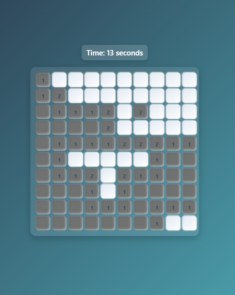

# 💣 Angular Minesweeper Game

A modern **Minesweeper Game** built with **Angular 19** using **standalone components** and a **service-driven architecture**.  
It features a **grid-based game board**, **dynamic mine placement**, **timer & score tracking**, and a **responsive modern UI** — recreating the classic Minesweeper experience in the browser.

---

## 🌐 Live Demo

👉 [Click here to play the game](https://ahmad-889.github.io/minesweeper/)

---

## 🎯 What I Built

This project is structured with **standalone components** for each part of the game and a **Game Service** that controls the game logic (mines, tiles, win/lose state).  
Here’s the breakdown:

* ✅ `BoardComponent`: Renders the Minesweeper grid and handles clicks  
* ✅ `TileComponent`: Represents each cell (revealed, hidden, flagged, mine)  
* ✅ `GameService`: Manages mine placement, tile state, and win/loss logic  
* ✅ `HeaderComponent`: Displays timer, mine counter, and reset button  
* ✅ Fully responsive design, mobile-friendly, and styled with Tailwind CSS

---

## 💡 Key Features

* 💥 **Classic Minesweeper mechanics** (reveal, flag, chain-reveal for empty cells)  
* ⏱ **Game timer** with start/stop logic  
* 🚩 **Mine counter** with flagging support  
* 🏆 **Win/Loss detection** with reset option  
* 📱 Fully responsive design for desktop & mobile  
* 🎨 Clean modern UI with smooth animations  

---

## 🧱 Technologies Used

* Angular 19 (Standalone Components)
* TypeScript
* SCSS (Responsive UI)

---

## 📸 Screenshot



---

## 📁 Project Structure


```
src/
└── app/
├── components/
│ ├── cell/
│ │ ├── cell.component.ts # Each individual cell
│ │ ├── cell.component.html
│ │ └── cell.component.scss
│ ├── minesweeper/
│ │ ├── minesweeper.component.ts # Main game board (timer, reset, mine container)
│ │ ├── minesweeper.component.html
│ │ └── minesweeper.component.scss
│ └── timer/
│ ├── timer.component.ts # Timer
│ ├── timer.component.html
│ └── timer.component.scss
├── services/
│ ├──game.service.ts # Handles game logic (mines, win/lose, reveal, flags)
│ └──timer.service.ts # Handles time logic 
└── app.component.ts # Root component
```

## 🚀 Running the Project

Install Angular CLI if you haven't:

```bash
npm install -g @angular/cli
```

Install dependencies and serve:

```bash
npm install
ng serve
```

Visit `http://localhost:4200` to see the custom directives in action.

---

## 🔗 Author
Made with ❤️ by
Muhammad Ahmad
